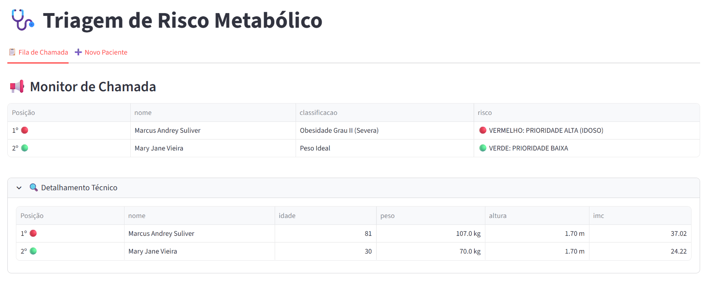
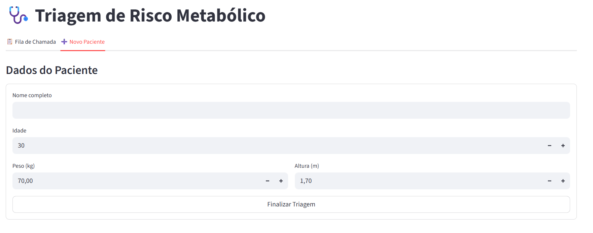
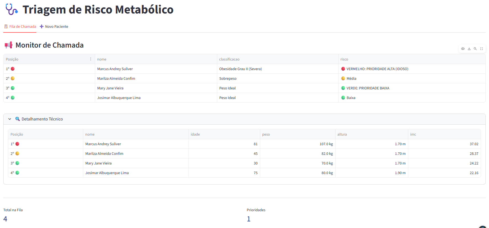

# 🩺 Triagem de Risco Metabólico


Sistema inteligente de triagem clínica focado em **UX Minimalista** e **Gestão de Fila por Prioridade**. O software automatiza o cálculo de IMC e organiza o fluxo de atendimento com base no risco metabólico e critérios de idade.

---

## 📸 Interface do Sistema

<div align="center">
  <p><b>Monitor de Chamada</b></p>
  
  <br>
  <p><b>Fluxo de Cadastro</b></p>
  
  <br>
  <p><b>Detalhamento Tecnico</b></p>
  
</div>

---

## 📋 Funcionalidades Principais

* 🚀 **Fila Inteligente**: Ordenação automática priorizando idosos e casos de obesidade crítica.
* 🎨 **Monitor Minimalista**: Visual limpo com indicadores discretos (🔴, 🟡, 🟢) para reduzir a fadiga visual do operador.
* 🔍 **Detalhamento Técnico**: Seção expansível para profissionais de saúde consultarem dados biométricos detalhados sem poluir a tela principal.
* 🧮 **Cálculo Automático**: Classificação instantânea de Obesidade Grau I, II e III conforme os padrões de saúde.

## 🛠️ Estrutura do Projeto

```text
├── app.py           # Interface Streamlit e Lógica de UI
├── db.py            # Camada de Dados (SQLite + Pandas)
├── utils.py         # Motor de Cálculo e Regras de Negócio
└── README.md        # Documentação do Projeto